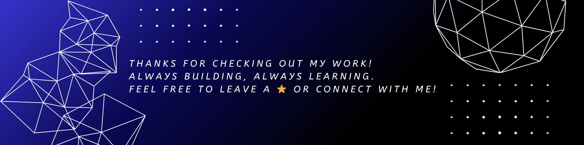

# Ramakant Singh Chouhan  
`distortion-12` | he/him  

**Follow**  
  

---

## 🚀 **About Me**  
- 🔭 **Working on:** [EaseBooking System](https://github.com/distortion-12/EaseBookings)  
- 🌱 **Learning:** Data Structure & Algorithm with Java  
- 🤝 **Collaborate:** Open to MERN/Java projects!  
- ⚡ **Fun fact:** Built a voice-controlled AI named **Lyra**!  

---

## 🛠️ **Tech Stack**  
**Languages:**  

**Frontend:**  

**Backend & Database:**  

---

## 🌟 **Projects** 
1. **[eSports Platform](https://github.com/distortion-12/eSports-Arena)**  
   `JavaScript` `React` `WebSocket`  
   *Live tournament platform for PUBG/BGM.*  

2. **[LYRA Voice Assistant](https://github.com/distortion-12/Lyra-Virtual-Assistant)**  
   `Python` `NLP`  
   *AI assistant with weather/search automation.*  

3. **[File Encryptor](https://github.com/distortion-12/FileEncryptor)**  
   `Java` `AES Cryptography`  
   *GUI tool for secure file encryption.*

4. **[EaseBookings](https://github.com/distortion-12/EaseBookings)**  
   `JavaScript`  
   *Booking management system.*

5. **[Git Repo Visualizer 2.0](https://github.com/distortion-12/Git-Repo-Visualizer-2.0)**  
   `JavaScript`  
   *Enhanced version of the repository visualizer.*
---

## 📅 **Contribution Graph**  
  

---

## 📫 **Connect With Me**  

